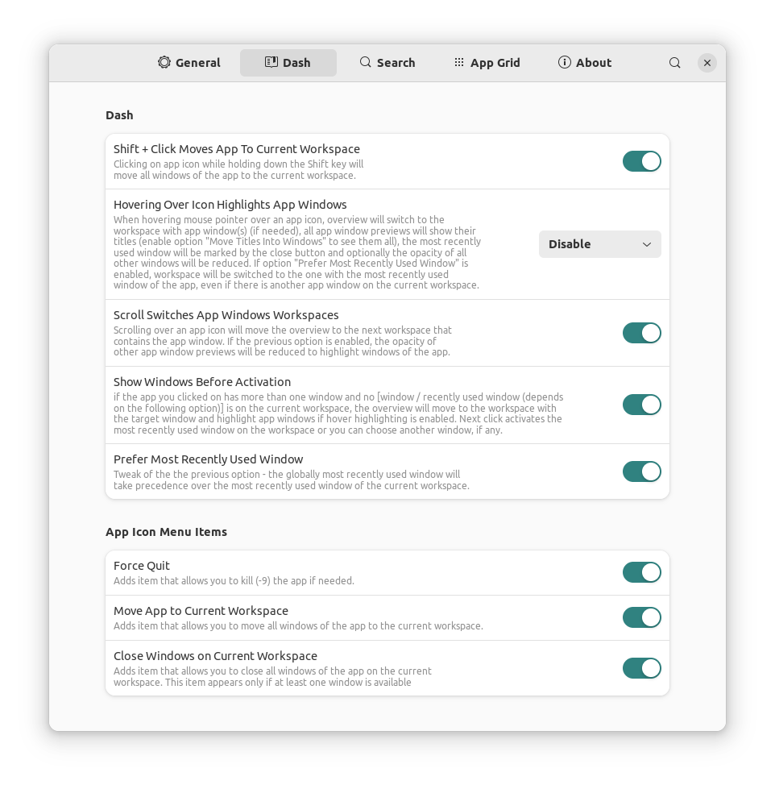
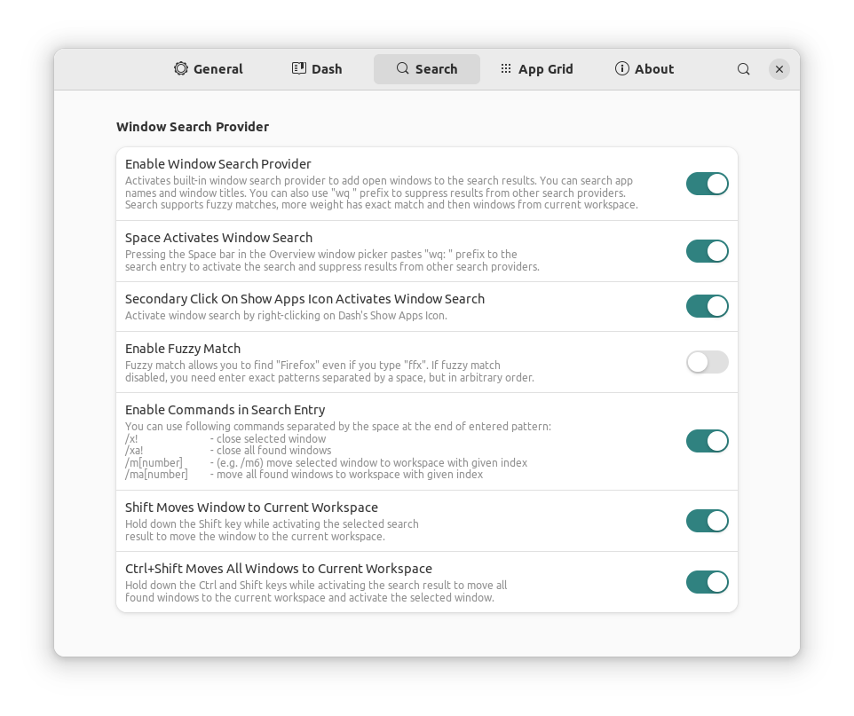
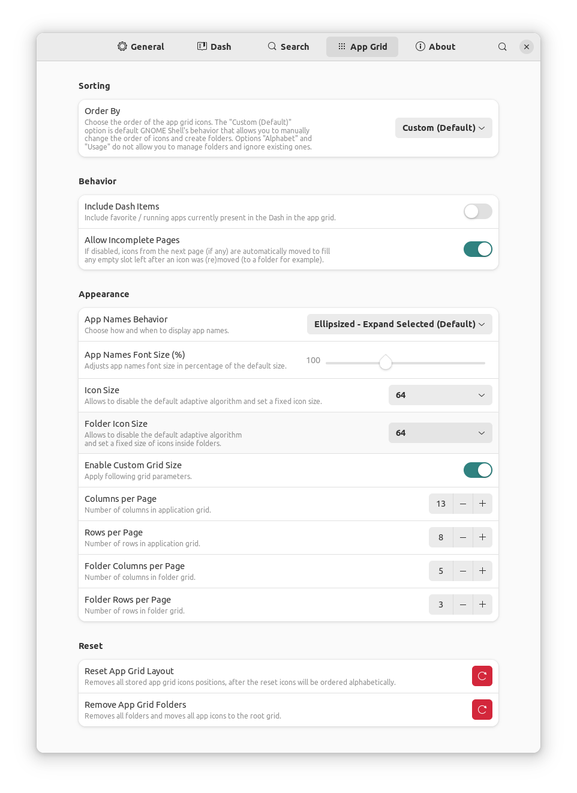

# Overview Feature Pack

A GNOME Shell extension that adds useful features to the Activities Overview. See screenshots with preferences window below.

Supported versions of GNOME Shell: 41, 42.

## Install from GitHub repository
The most recent version in the repository is the one I'm currently running on my own systems, problems may occure, but usually nothing serious.
Run following commands in the terminal (`git` needs to be installed, navigate to the directory you want to download the source):

    git clone https://github.com/G-dH/overview-feature-pack.git
    cd workspace-switcher-manager/overview-feature-pack@G-dH.github.com/
    make install

### Enabling the extension
After installation you need to enable the extension and access its settings.

- First restart GNOME Shell (`ALt` + `F2`, `r`, `Enter`, or Log Out/Log In if you use Wayland)
- Now you should see *Overview Feature Pack* extension in *Extensions* application (re-open the app if needed to load new data), where you can enable it and access its Preferences window by pressing `Settings` button.

